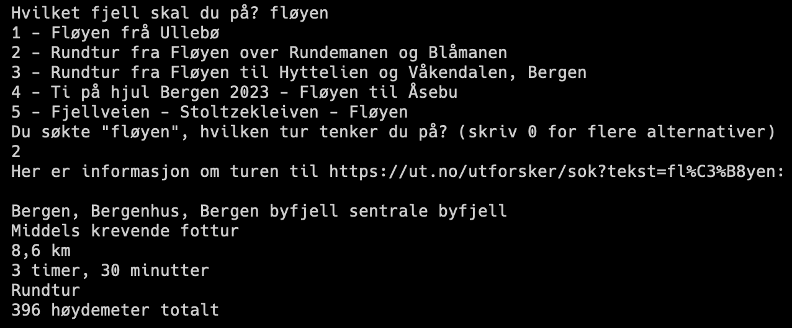

# Mountain Info Web Scraper

## Description
This Python script allows you to enter the name of a mountain and retrieve information about that mountain. The script uses Selenium for web automation and BeautifulSoup for HTML parsing to scrape data from `https://ut.no/`. The project was made as my first python-project back in 2019 to learn webscraping, but the code has later been refactored.

##



## Prerequisites
- Python 3.x
- Selenium
- BeautifulSoup
- requests
- Chrome WebDriver

## Installation

1. Clone the repository:
    ```
    git clone https://github.com/yourusername/mountain-info-web-scraper.git
    ```
    
2. Navigate to the project directory:
    ```
    cd mountain-info-web-scraper
    ```
    
3. Install required Python packages:
    ```
    pip install -r requirements.txt
    ```
    
4. Download [Chrome WebDriver](https://sites.google.com/a/chromium.org/chromedriver/) and place it in the project directory.

## Usage

Run the script by executing:
